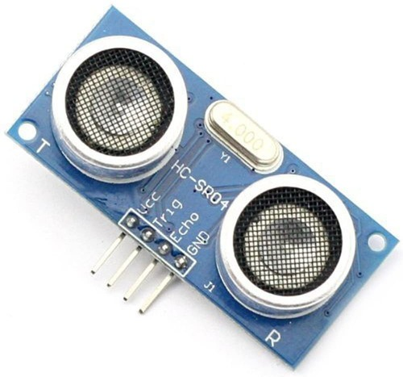
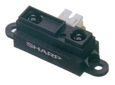
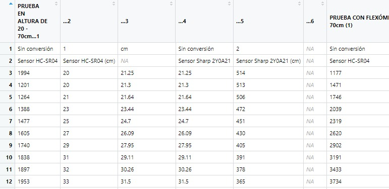

```{r setup, include=FALSE}
knitr::opts_chunk$set(echo = TRUE)
```

## GitHub

Puedes visitar nuestro repositorio en internet, para más información : [**Nuestro Repositorio**](https://github.com/Alejandro29-tech/Assignment2)

## 1.1 Data acquisition

## Sensor ultrasonido HC-SR04

El sensor de ultrasonido HC-SR04 es un sensor popular utilizado para medir distancias. en caunto asu funcionamiento, El HC-SR04 emite una serie de pulsos de ultrasonido y mide el tiempo que tarda en recibir el eco de estos pulsos. Utiliza esta información para calcular la distancia desde el sensor hasta el objeto.El rango de medición del HC-SR04 es de 2 cm a 4 metros. en cuanto a su precicion es +/- de aproximadamente 3 mm. su angulo de apertura es de 15° respecto al centro del emisor y trabaja bajo una frecuencia de 40KHz, tambien utiliza como interfaaz de comunicacion el sistema de PWM para enviar o recibir señales. para mas infomacion se puede consultar el [**Datasheet**](http://www.datasheetcafe.com/hc-sr04-pdf-22772/)

){width="280"}

## Sensor infrarrojo Sharp 2Y0A21

El Sharp 2Y0A21 emite un haz de luz infrarroja y mide la cantidad de luz reflejada por un objeto para calcular la distancia mediante un procesador integrado encargado de realizar el cálculo, El rango de medición es de 10 cm a 80 cm. su precision es de +/- aproximadamente 1 cm. funciona con una frecuancia de 38KHz y su angulo de deteccion es de 25°, en el aspecto de comunicacion no cuenta con una propia simplemente devuelve una tensión analógica proporcional a la distancia medida. para mas infomacion se puede consultar el [**Datasheet**](https://global.sharp/products/device/lineup/data/pdf/datasheet/gp2y0a21yk_e.pdf)

{width="280"}

## 2.1 Data acquisition

the following sensors are used to perform this data acquisition and data projection project.

```{r adquisiscion, message=FALSE}
library(dplyr)
library(tidyverse)
library(readxl)
library(knitr) 
library(kableExtra)
# Leer el archivo Excel
datos <- read_excel("~/UNIVERSIDAD/8vo Semestre/Area electronica (electiva)/Assignment2/R/1.1.xlsx")
tabla_adq<-kable(datos)
tabla_adq <- tabla_adq %>%
  kable_styling(full_width = FALSE)
tabla_adq
```



## Modelo lineal para HC-SR04 (Sensor1)

El sensor de ultrasonido HC-SR04 es una herramienta utilizada para medir distancias en proyectos electrónicos. Sin embargo, es necesario crear un modelo matemático que permita predecir las mediciones del sensor con mayor precisión y eficacia. Una forma de lograr esto es mediante la creación de un modelo lineal que relacione las mediciones del sensor con las variables que afectan su desempeño. como se ve acontinuacion:

```{r,message=FALSE}
# Modelo lineal para Sensor1
datos <- read_excel("~/UNIVERSIDAD/8vo Semestre/Area electronica (electiva)/Assignment2/R/1.1.xlsx")
model_lin_Sensor_1 <- lm(Sensor1 ~ Sensor1_cm, data = datos)

# Modelo lineal regularizado para Sensor1
library(glmnet)
X<-as.matrix(datos[,c("Sensor1_cm","cm")])
y<-as.matrix(datos[,c("Sensor1")])
model_reg_Sensor_1 <- glmnet(X, y, alpha = 1)

# Modelo lineal para Sensor2
model_lin_Sensor2 <- lm(Sensor2 ~ Sensor2_cm, data = datos)

# Modelo lineal regularizado para Sensor2
model_reg_Sensor2 <- glmnet(as.matrix(datos[,c("Sensor2_cm","cm")]), as.matrix(datos[,c("Sensor2")]), alpha = 1)

```

## 2.1 Cargar datos

```{r,message=FALSE}
knitr::opts_chunk$set(echo = TRUE)
library(tidyverse)
library(glmnet)
library(kableExtra)

# Cambiar nombres de columnas
colnames(datos) <- c("Sensor1", "Sensor1_cm", "cm", "Sensor2", "Sensor2_cm")

# Visualizar tabla
kable(datos[1:10,], caption = "Primeros 10 datos del dataset") %>% kable_classic("striped")
```

## Renombrar las columnas

```{r,message=FALSE}
colnames(datos) <- c("Sensor1", "Sensor1_cm", "cm", "Sensor2", "Sensor2_cm")
```

## KNN para el Sensor 1

Para el entrenamiento mediante el metodo e KNN para el sensor HC-SR04, veremos cómo utilizar los datos de entrenamiento para determinar los k vecinos más cercanos a una instancia desconocida y cómo clasificar o predecir el valor de distancia basado en la mayoría de los valores de los vecinos más cercanos.

```{r,message=FALSE}
library(caret)
modelo_sensor1 <- train(Sensor1_cm ~ cm, data = datos, method = "knn")
```

## Hacer una predicción para un nuevo valor de sensor 1

```{r,message=FALSE}
nuevo_valor_sensor1 <- 20 # Por ejemplo
prediccion_sensor1 <- predict(modelo_sensor1, newdata = data.frame(cm = nuevo_valor_sensor1))
```

# Imprimir la predicción para el Sensor 1

```{r,message=FALSE}
print(prediccion_sensor1)
```

## Entrenar el modelo KNN para el Sensor 2

```{r,message=FALSE}
modelo_sensor2 <- train(Sensor2_cm ~ cm, data = datos, method = "knn")

```

## Hacer una predicción para un nuevo valor de sensor 2

```{r,message=FALSE}
nuevo_valor_sensor2 <- 30 # Por ejemplo
prediccion_sensor2 <- predict(modelo_sensor2, newdata = data.frame(cm = nuevo_valor_sensor2))
```

# Imprimir la predicción para el Sensor 2

```{r,message=FALSE}
print(prediccion_sensor2)
```
